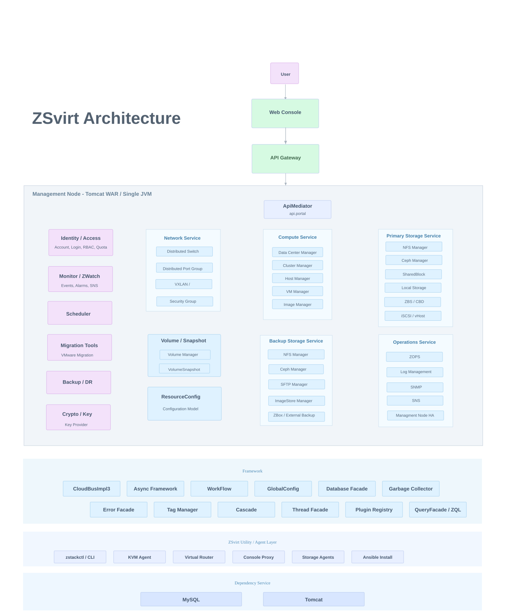

<!-- synced-with: README.md@e9235837 -->

  
  

     &nbsp;&nbsp;
  

  <h1 align="center">
    Virtualisation open source
     
    Prête pour l’entreprise, portée par la communauté
  </h1>

  

    
    
    
    
  

  

    <a href="./README.md">English</a> |
    <a href="./README_zh.md">简体中文</a> |
    <a href="./README.zht.md">繁體中文</a> |
    <a href="./README.ko.md">한국어</a> |
    <a href="./README.de.md">Deutsch</a> |
    <a href="./README.es.md">Español</a> |
    <strong>Français</strong> |
    <a href="./README.it.md">Italiano</a> |
    <a href="./README.da.md">Dansk</a> |
    <a href="./README.ja.md">日本語</a> |
    <a href="./README.pl.md">Polski</a> |
    <a href="./README.ru.md">Русский</a> |
    <a href="./README.bs.md">Bosanski</a> |
    <a href="./README.ar.md">العربية</a> |
    <a href="./README.no.md">Norsk</a> |
    <a href="./README.br.md">Português (Brasil)</a> |
    <a href="./README.th.md">ไทย</a> |
    <a href="./README.tr.md">Türkçe</a> |
    <a href="./README.uk.md">Українська</a> |
    <a href="./README.bn.md">বাংলা</a> |
    <a href="./README.gr.md">Ελληνικά</a> |
    <a href="./README.vi.md">Tiếng Việt</a>
  

> **Essayez maintenant, sans matériel physique.** Téléchargez l’[image qcow2 ou OVA](https://zsvirt.io/download), démarrez-la comme VM sur VMware, VirtualBox, KVM ou un hôte cloud (virtualisation imbriquée), puis configurez une adresse IP : le nœud de gestion ZSvirt est prêt. Consultez [Exécuter ZSvirt dans une VM](https://zsvirt.io/en/docs/quick-start/nested-virtualization-management-node) ou le [Guide de démarrage](https://zsvirt.io/en/docs/quick-start).

## Qu’est-ce que ZSvirt ?
ZSvirt apporte au monde open source le moteur de virtualisation ZSphere de [ZStack](https://www.zstack-cloud.com/), éprouvé en entreprise. Soutenu par [ZStack](https://www.zstack-cloud.com/), un acteur établi de l’infrastructure, ZSvirt est une plateforme légère et évolutive pour exécuter et gérer des machines virtuelles sans dépendance à un fournisseur.

Installez un nœud de gestion, connectez des hôtes KVM et gérez VM, clusters, stockage et réseaux via une interface web, une API RESTful (avec Terraform et les SDK Go/Python/Java) ou une CLI. Les outils de migration VMware sont intégrés : migration en ligne, import OVF et téléversement VMDK.

## Visite du produit

  

    <strong>📊 TABLEAU DE BORD — Vue unifiée des opérations</strong>
  

   

  

    
  

 

  

    <strong>🗂️ INVENTAIRE — Gestion centralisée de l’infrastructure</strong>
  

   

  

    
  

 

  

    <strong>🔄 GESTION DES MIGRATIONS — Migration des charges de travail</strong>
  

   

  

    
  

## Démo en ligne

La [démo ZSvirt](https://demo.zsvirt.io/) est un environnement hébergé gratuit pour essayer la plateforme en ligne, sans installation ni inscription. Ouvrez le lien et cliquez sur **Demo Login** pour commencer.

## Architecture

ZSvirt utilise une architecture modulaire articulée autour de la gestion des ressources virtualisées, du plan de gestion, des services d’extension et des outils d’exploitation.

Fonctions principales :

- **Virtualisation du calcul** : gestion des hôtes, clusters, machines virtuelles, images et cycles de vie.
- **Virtualisation réseau** : réseaux virtuels, services réseau, groupes de sécurité et fonctions associées.
- **Virtualisation du stockage** : stockage primaire, stockage de sauvegarde, volumes, instantanés et gestion des ressources de stockage.
- **Plan de gestion** : framework API, modèle d’autorisations, événements, alarmes, audit et exploitation du système.
- **Services d’extension** : migration, reprise après sinistre, supervision, quotas, contrôle d’accès et exploitation en entreprise.
- **Outils et intégrations** : installation, diagnostic, migration, scripts d’automatisation, agents, CLI et intégration de systèmes externes.

L’architecture logicielle privilégie l’asynchronisme, l’absence d’état, l’extensibilité et l’automatisation :

- **Architecture asynchrone** : messages, méthodes et appels HTTP asynchrones pour réduire les blocages et améliorer le débit du système.
- **Services sans état** : une requête ne dépend pas de l’état des autres, ce qui facilite la mise à l’échelle, la reprise et l’exploitation.
- **Extensions par plugins** : extension horizontale des types de ressources, fonctions métier et intégrations au moyen de plugins.
- **Moteur de workflows** : ordonne les opérations complexes et prend en charge l’annulation et la reprise en cas d’échec.
- **Étiquettes et requêtes** : extension des attributs de ressources, classification, requêtes unifiées et orchestration automatisée.
- **Déploiement automatisé** : des outils automatisent le déploiement, la configuration et l’exploitation pour réduire la complexité du déploiement et de la maintenance.

  

## Guide de migration VMware

Alors que les entreprises réévaluent leurs stratégies de virtualisation, migrer de VMware vers d’autres plateformes devient un enjeu pour maîtriser les coûts, assouplir l’infrastructure et préserver la stabilité opérationnelle à long terme.

ZSvirt fournit des fonctions de migration et des outils d’exploitation pour évaluer, planifier et transférer les charges de travail d’environnements VMware existants vers une infrastructure virtualisée ZSvirt.

- [Guide de migration VMware](https://zsvirt.io/vmware-alternative/)

  

## Démarrage rapide

Le moyen le plus rapide d’évaluer ZSvirt est de suivre le guide de démarrage de la documentation. Il explique comment préparer les ressources de calcul, réseau et stockage, initialiser le service de gestion et créer votre première machine virtuelle.

Vous préférez commencer dans une VM ? Téléchargez l’[image qcow2 ou OVA](https://zsvirt.io/download) et exécutez le nœud de gestion dans un hyperviseur — voir [Exécuter ZSvirt dans une VM](https://zsvirt.io/en/docs/quick-start/nested-virtualization-management-node).

🚀 [Démarrage rapide](https://zsvirt.io/en/docs/quick-start) 
▶️ [Vidéo](https://youtu.be/LsSJlBRUvYw)

## Bonnes pratiques
Basé sur le même moteur d’entreprise que ZSphere, ZSvirt bénéficie des succès éprouvés auprès des clients internationaux présentés ci-dessous.

  

## Comparaison des plateformes de virtualisation

Proxmox VE, VMware vSphere et ZSvirt

  

## Feuille de route

#### 2e semestre 2026

| Domaine | Travaux prévus |
|---|---|
| **Sécurité** | Ajouter le chiffrement des disques de VM Ajouter le chiffrement de la migration de VM |
| **DRS et migration de VM** | Ajouter des options de migration plus flexibles : • Pouvoir migrer les disques individuellement • Prendre en charge la migration à chaud et à froid pour le scénario SAN vers SAN |
| **ZMigrate** | **ZMigrate 2.1** : • Ajouter une vérification préalable pour réduire les risques des migrations complexes • Des flux de migration plus simples et plus intelligents |
| **Exploitation** | Ajouter des métriques de temps CPU Ready de la VM, de latence de lecture/écriture du disque de la VM, de taux de perte de paquets réseau et de temps CPU Ready de l'hôte Prendre en charge des niveaux de journal plus fins lors de la redirection vers un syslog externe Ajouter la supervision des périphériques NVMe et FC, y compris les IOPS et la latence Ajouter des pilotes QXL intégrés à VMTools pour améliorer l'affichage et la résolution de la console de la VM |
| **Gestion de l'inventaire** | Étendre l'enregistrement du stockage et des VM à l'enregistrement sur le même site |

## Gouvernance

ZSvirt suit un modèle de gouvernance open source léger qui définit la maintenance du projet, les décisions et la collaboration entre contributeurs.

[GOVERNANCE.md](GOVERNANCE.md) présente les rôles du projet, les responsabilités des mainteneurs, les processus de décision, la gestion des versions et la collaboration communautaire.

Avec la croissance de la communauté, ce modèle pourra intégrer des mainteneurs dédiés, des groupes de travail et des processus plus formels.

## Contribuer

Nous accueillons et apprécions les contributions de la communauté : correction de bugs, amélioration de la documentation, propositions de fonctions, tests ou partage de pratiques de déploiement, migration et exploitation. Chaque contribution améliore ZSvirt.

Pour débuter, vous pouvez améliorer la documentation, signaler des problèmes, vérifier des tests, partager une expérience de migration ou participer aux discussions. Les développeurs peuvent aussi améliorer le code, les outils et les intégrations.

Les contributeurs actifs pourront être mis à l’honneur dans les remerciements communautaires, les notes de version, les listes de contributeurs ou de futurs programmes communautaires.

Avant de contribuer, veuillez lire :

- [CONTRIBUTING.md](CONTRIBUTING.md)

## Sécurité

La procédure de signalement des vulnérabilités est décrite dans [SECURITY.md](SECURITY.md).

Ne signalez pas de vulnérabilités via des GitHub Issues ou Discussions publiques.

## Licence

ZSvirt est distribué sous [GNU General Public License v3.0](LICENSE).

Certains dépôts ou composants peuvent inclure des logiciels open source tiers sous d’autres licences. Consultez les fichiers `LICENSE`, `NOTICE` et associés dans chaque dépôt.

## Ressources

<table>
  <tr>
    <td width="50%">
      <h3>🌐 Site communautaire</h3>
      
Découvrez les fonctions, cas d’usage, actualités et ressources communautaires de ZSvirt.

      <a href="https://zsvirt.io"><strong>Visiter le site →</strong></a>
    </td>
    <td width="50%">
      <h3>▶️ Vidéos</h3>
      
Regardez la présentation de ZSvirt et découvrez ses principales fonctions.

      <a href="https://youtu.be/c6pYmlIoPIU"><strong>Voir la vidéo du produit →</strong></a>
    </td>
  </tr>

  <tr>
    <td width="50%">
      <h3>📝 Blog</h3>
      
Retrouvez les nouveautés des versions, récits d’ingénierie et analyses sur la virtualisation.

      <a href="https://zsvirt.io/blog"><strong>Lire le blog →</strong></a>
    </td>
    <td width="50%">
      <h3>💬 GitHub Discussions</h3>
      
Posez des questions, partagez vos idées et échangez avec la communauté ZSvirt.

      <a href="https://github.com/ZSvirt/zsvirt/discussions"><strong>Participer aux discussions →</strong></a>
    </td>
  </tr>

  <tr>
    <td width="50%">
      <h3>▶️ YouTube</h3>
      
Suivez la chaîne ZSvirt pour les démonstrations, tutoriels et mises à jour produit.

      <a href="https://youtube.com/@ZSvirt"><strong>Suivre sur YouTube →</strong></a>
    </td>
    <td width="50%">
      <h3>💼 LinkedIn</h3>
      
Suivez ZSvirt pour les actualités du projet, temps forts communautaires et analyses du secteur.

      <a href="https://www.linkedin.com/in/zsvirt-community/"><strong>Suivre sur LinkedIn →</strong></a>
    </td>
  </tr>

  <tr>
    <td width="50%">
      <h3>𝕏 X</h3>
      
Recevez les dernières annonces et actualités de la communauté ZSvirt.

      <a href="https://x.com/ZSvirt"><strong>Suivre sur X →</strong></a>
    </td>
    <td width="50%">
      <h3>🎮 Discord</h3>
      
Rejoignez la communauté ZSvirt pour poser vos questions, partager vos idées et rencontrer d’autres utilisateurs.

      <a href="https://discord.com/invite/KHsw63z9xA"><strong>Rejoindre Discord →</strong></a>
    </td>
  </tr>
</table>
